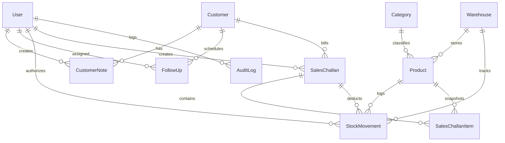

# FlowLedger — Smart Mini ERP + CRM Operations Portal

> **"Every sale. Every stock movement. One clear workflow."**

FlowLedger is a modern B2B SaaS Operations Command Center and Mini ERP + CRM portal designed for wholesale, manufacturing, and distribution enterprises. Built with **React 19, TypeScript, Vite, Tailwind CSS, Node.js, Express, Prisma ORM, and PostgreSQL**, it eliminates disjointed spreadsheets by connecting customer relationship workflows, multi-warehouse inventory ledgers, and atomic sales challan fulfillment.

---

## 🌟 Key Highlights & Unique Features

### 1. 🏢 Operations Command Center (Dashboard)
- **Real-time KPI Metrics**: Total Revenue, Customer Base, Pending & Overdue Follow-ups, Real-time Inventory Valuation, Low Stock SKUs, Monthly Challans count with previous period trend comparisons.
- **Interactive Analytics Visualizations**: Interactive Recharts for Monthly Revenue & Volume Trends, Customer Segment Distribution, Challan Status breakdown, and Top-Selling Products.
- **Smart Alerts ("Attention Required")**: Live operational triggers highlighting out-of-stock items, critical inventory levels, overdue client follow-ups, and unconfirmed draft challans with 1-click deep navigation.

### 2. 👥 Customer 360 & CRM Module
- **Consignee Directory**: Detailed customer management with Indian GSTIN validation, registered addresses, contact persons, credit terms, and status tracking (Lead, Active, Inactive).
- **Customer 360 Deep View**:
  - Unified **Visual Activity Timeline** aggregating customer creation, follow-ups, challan generation, confirmation, and internal notes into a single chronological stream.
  - Financial summary: Lifetime Spend, Average Order Value, Total Dispatched Units, and Purchase History.
  - Interactive **Notes Ledger** for operational and billing communications.

### 3. ⏱️ Smart Follow-up Pipeline
- Categorized Kanban and List views: **Overdue Actions**, **Today's Schedule**, and **Upcoming Pipeline**.
- One-click actions: **Complete**, **Reschedule** (with date picker), and **Add Audit Note**.
- Priority badges (High, Medium, Low) and automatic dashboard escalation for overdue items.

### 4. 📦 Product Catalog & Dynamic Inventory Health
- Automatic, real-time inventory health calculation:
  - 🟢 **Healthy**: Current Stock > $1.5 \times \text{Minimum Threshold}$
  - 🟡 **Low Stock**: Current Stock $\le 1.5 \times \text{Minimum Threshold}$
  - 🔴 **Critical**: Current Stock $\le \text{Minimum Threshold}$
  - ⚫ **Out of Stock**: Current Stock $= 0$
- Multi-warehouse allocation, measurement units (`PCS`, `BOX`, `SET`, `KG`, `MTR`), and live valuation.

### 5. 🔄 Complete Stock Movement Ledger
- Immutable ledger tracking every stock intake (`IN`) and dispatch (`OUT`).
- Complete reference linking (`PO-2026-XXXX`, `SC-2026-XXXX`, `RET-XXXX`).
- Atomic manual stock adjustments and purchase receipt inwards.

### 6. 📑 Multi-Step Sales Challan Flow & Live Stock Preview
- **Step 1: Select Consignee / Customer** with live profile preview.
- **Step 2: Add Products with LIVE STOCK PREVIEW**:
  - Displays **Available Stock**, **Requested Quantity**, and **Remaining After Sale** in real time with visual capacity progress bars.
  - **Over-allocation Protection**: If requested quantity exceeds warehouse stock, a prominent alert warns the operator (*"Insufficient stock — reduce quantity by X units"*), strictly blocking confirmation.
- **Step 3: Dispatch & Logistics Details**: Carrier transporter name, vehicle fleet number, and gate instructions.
- **Step 4: Review & Finalize**:
  - **Draft Mode**: Saves the challan without deducting inventory.
  - **Confirmed Mode**: Runs inside an atomic database transaction (`prisma.$transaction`), decrements stock, logs `StockMovement (OUT)`, records timestamps, and triggers low-stock alerts.
  - **Cancellation with Atomic Restoral**: Cancelling a confirmed challan safely rolls back and restores stock into the warehouse.

### 7. 🖨️ Professional PDF Document Generator
- 1-click client-side PDF generation using `jsPDF` and `jspdf-autotable`.
- Includes company tax branding, GSTIN, customer details, itemized table, subtotal, 18% Integrated GST calculation, grand total, and authorized signatory signature box.
- Direct **Download PDF**, **Print Preview**, and **Share Link** options.

### 8. ⚡ Global Command Palette (`Cmd+K` / `/`)
- Instant keyboard-driven global search across Customers, Products, SKUs, Mobile Numbers, and Sales Challans with deep navigation.

### 9. 🛡️ Role-Based Access Control (RBAC) & 1-Click Demo Evaluation
- Granular permission matrix across **Admin**, **Sales**, **Warehouse**, and **Accounts**.
- Integrated **1-Click Demo Persona Switcher** on the login screen and top header bar for instant evaluation.

### 10. 🔒 Immutable Audit Activity Log
- Filterable timeline tracking every login, customer creation/edit, product modification, stock movement, and challan confirmation with structured JSON diff inspectors.

---

## 🏗️ Architecture & Tech Stack

```
Mini_ERP/
├── client/                      # React 19 + TypeScript + Vite + Tailwind CSS Frontend
│   ├── src/
│   │   ├── api/                 # Axios client with JWT interceptor & React Query endpoints
│   │   ├── components/          # Reusable design system (Buttons, Modals, Drawers, Cards, StatCards)
│   │   ├── context/             # AuthContext (with Demo Switcher), NotificationContext, UIContext
│   │   ├── layouts/             # DashboardLayout, AuthLayout, TopNav, Sidebar
│   │   ├── pages/               # Dashboard, CRM, Customer360, Follow-ups, Catalog, Challans, Audit
│   │   ├── utils/               # Currency (INR), date formatters, and jsPDF generator
│   │   └── types/               # Strict TypeScript interfaces
├── server/                      # Node.js + Express + TypeScript + Prisma Backend API
│   ├── prisma/
│   │   ├── schema.prisma        # Database schema with relations, indexes, and cascades
│   │   └── seed.ts              # Production seed data (5+ users, 32 customers, 52 products, 110+ movements)
│   ├── src/
│   │   ├── config/              # Prisma client singleton, environment constants
│   │   ├── controllers/         # Auth, Customer, Product, Inventory, Challan, Dashboard, Search, Audit
│   │   ├── middleware/          # JWT auth, RBAC authorization, Zod validation, error handler, rate limiter
│   │   ├── routes/              # Modular Express route handlers
│   │   └── server.ts            # Express server initialization
├── postman/                     # Ready-to-import Postman Collection
├── Dockerfile                   # Multi-stage production container build
├── docker-compose.yml           # PostgreSQL + API + Web container orchestration
└── README.md                    # Comprehensive documentation
```

---

## 👥 Demo Personas & Credentials

You can log in with any of these credentials or simply click the persona cards on the Login page / Top Header:

| Role | Name | Email | Password | Allowed Modules |
| :--- | :--- | :--- | :--- | :--- |
| **ADMIN** | Sourav Singh | `admin@flowledger.io` | `password123` | Full system access to all modules, setup, and audits |
| **SALES** | Priya Sharma | `sales@flowledger.io` | `password123` | Customers, Customer 360, Follow-ups, Challans, Catalog |
| **WAREHOUSE** | Arun Kumar Patel | `warehouse@flowledger.io` | `password123` | Product Catalog, Stock Movements, Inward Adjustments |
| **ACCOUNTS** | Ananya Sen | `accounts@flowledger.io` | `password123` | Customers, Challans, Revenue Reports, Audit Logs |

---

## 📊 Database Schema (Prisma)



---

## 🚀 Quickstart & Local Setup

### Prerequisites
- **Node.js**: v18+ (Tested on v22)
- **npm**: v9+

### 1. Clone & Install Dependencies
```bash
# In the root workspace:
cd server && npm install
cd ../client && npm install
```

### 2. Initialize Database & Seed Realistic Enterprise Data
```bash
cd ../server

# Generate Prisma Client & Push Database Schema
npm run prisma:generate
npm run prisma:push

# Seed realistic Indian B2B customers, products, stock movements, and challans
npm run seed
```

### 3. Run Automated Integration Tests
```bash
# In server directory:
npm test
```
*Validates JWT authentication, RBAC authorization, product catalog, atomic stock deductions, and rollback safety.*

### 4. Start Development Servers
```bash
# In root workspace:
npm run dev

# Or start in separate terminals:
# Terminal 1 (Backend API on http://localhost:5000):
cd server && npm run dev

# Terminal 2 (Frontend Client on http://localhost:5173):
cd client && npm run dev
```

Visit **`http://localhost:5173`** in your browser.

---

## 🌐 API Endpoints Reference

| Method | Endpoint | Description | Role Required |
| :--- | :--- | :--- | :--- |
| `POST` | `/api/auth/login` | Authenticate and obtain JWT token | Public (Rate-limited) |
| `GET` | `/api/auth/me` | Fetch authenticated user profile | Authenticated |
| `GET` | `/api/dashboard/stats` | KPI counters, sales trends, distributions | Authenticated |
| `GET` | `/api/dashboard/alerts` | Urgent action triggers (low stock, overdue) | Authenticated |
| `GET` | `/api/customers` | Search & filter customer directory | Admin, Sales, Accounts |
| `GET` | `/api/customers/:id/360`| Customer 360 timeline & financial metrics | Admin, Sales, Accounts |
| `POST` | `/api/customers` | Register new customer with GSTIN | Admin, Sales |
| `POST` | `/api/customers/:id/notes`| Post note to customer timeline | Admin, Sales, Accounts |
| `GET` | `/api/followups` | Filter follow-ups (overdue/today/upcoming)| Admin, Sales |
| `PATCH`| `/api/followups/:id/status`| Mark completed or reschedule date | Admin, Sales |
| `GET` | `/api/products` | Catalog with dynamic inventory health | Authenticated |
| `POST` | `/api/inventory/adjust` | Manual stock movement / Inward PO | Admin, Warehouse |
| `GET` | `/api/inventory/movements`| Complete stock movement ledger | Admin, Warehouse, Accounts |
| `POST` | `/api/challans/preview-stock`| Check live stock capacity before sale | Admin, Sales |
| `POST` | `/api/challans` | Create sales challan (Draft/Confirmed) | Admin, Sales |
| `POST` | `/api/challans/:id/confirm`| Atomically confirm and deduct stock | Admin, Sales |
| `POST` | `/api/challans/:id/cancel` | Cancel challan and restore stock | Admin, Sales, Accounts |
| `GET` | `/api/search?q=...` | Unified global command search | Authenticated |
| `GET` | `/api/audit-logs` | Immutable audit log trail | Admin, Accounts |

---

## 🐳 Docker Deployment

### Run using Docker Compose:
```bash
docker-compose up --build
```

---

## 📄 License
FlowLedger is released under the **MIT License**.
